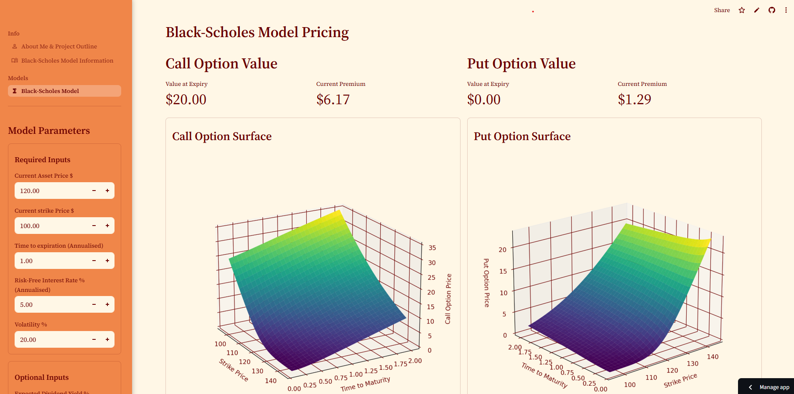

# 📈 Black-Scholes Model Visualisation Project

This project is a option pricing model visualisation tool implemented in Python.

## Project Overview

The primary goal of this project is to demonstrate the **Black-Scholes-Merton** option pricing model under changing variables.

### Features
* **Call & Put** graphs on OG BSM model and Lelan's variation.
* Easy **height and rotation** sliders for all graphs independent of eachother.
* Interactable and changeable graph **plotting parametres**.
* Interactable **Implied Volatility** and **Greeks** output based on model and option type.
* Tool to compare **price differences** between the two models.
* Efficient **data caching** to reduce computation times when style variables are changed e.g rotation.
* Project info + about me.
* Info on how the models work and some history behinfd them.

---

## Files in This Repository

* `bsm_model.py` | `bsm_leland_model`: The core compuatations using NumPy and SciPy.
* `plot_option_bsm.py` | `plot_option_bsml.py` | `plot_bsmVsbsml.py`: The core visualisation logic for the graph plotting.
* `bsm.py` | `bsm_info.py` | `about_me.py`: The frontend architecture built using streamlit.
* `computations.py` | `helper.py` | `graph_surface_helper.py`: The various functions used to make development easier.

---

## Tools Used

* [Python:](https://www.python.org/) (The core programming language for the project)
* [Streamlit:](https://streamlit.io/) (Used for building the interactive and user-friendly web interface)
* [Matplotlib:](https://matplotlib.org/) (Used for plotting the option pricing graphs and visualizing the effects of different parameters)
* [NumPy:](https://numpy.org/) (Used for efficient numerical computation of the models)
* [SciPy:](https://scipy.org/) (Used for advanced mathematical functions)

---

## How to Run the app locally

To run the app locally, make sure you have **Python** and some kind of package manager like **miniconda** installed and follow these steps in your terminal:

1.  **Clone the Repo (Make a copy):**
    ```bash
    git clone https://github.com/Nickyrayy/Black-Scholes-Model-Visualisation-Project.git
    ```

2.  **Move into the project**
    ```bash
    cd Black-Scholes-Model-Visualisation-Project
    ```

3.  **Install the dependencies:**
    ```bash
    pip install -r requirements.txt
    ```

4.  **Run the webpage locally!:**
    ```bash
    streamlit run streamlit_app.py
    ```
---

## Visualisation Example

This shows the first tab of the bsm page and is the original model visualised.



## License and Contributions

This project is released under the MIT License. Contributions, bug reports, and suggestions are welcome—please open an issue or submit a pull request.

